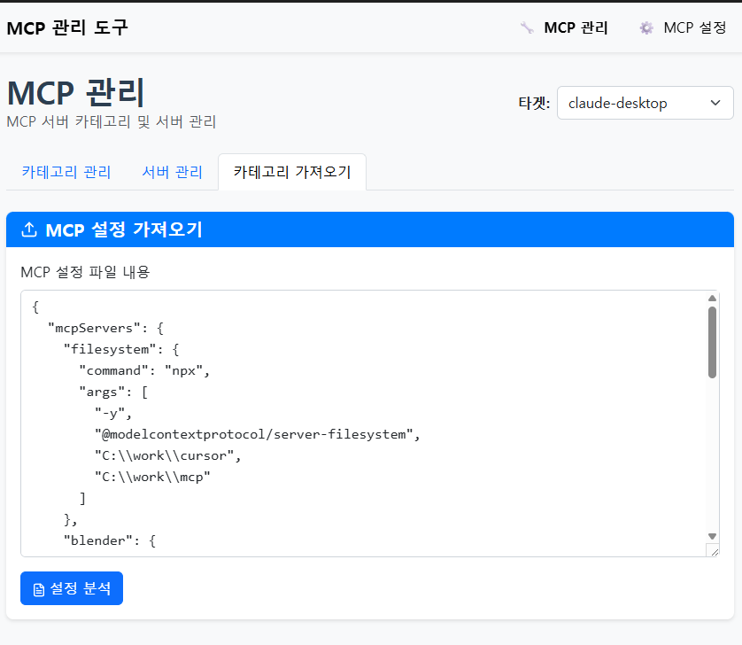
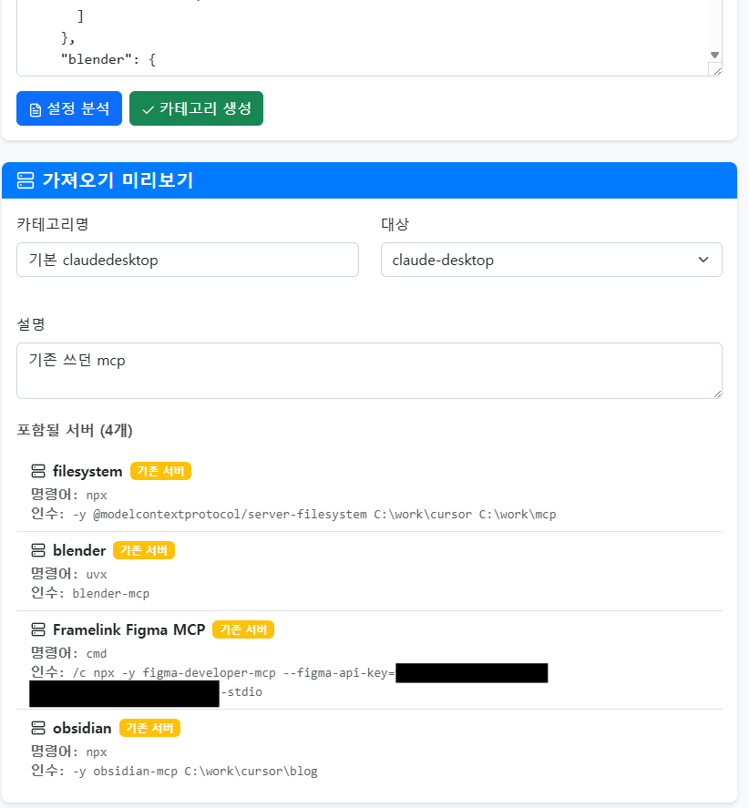
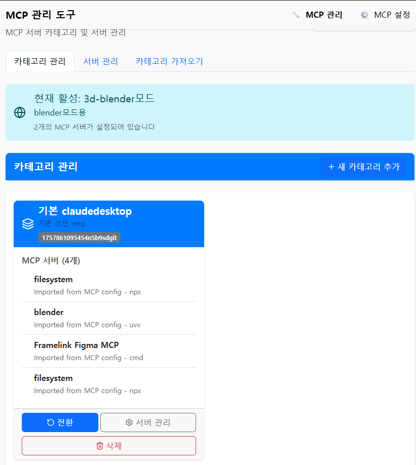
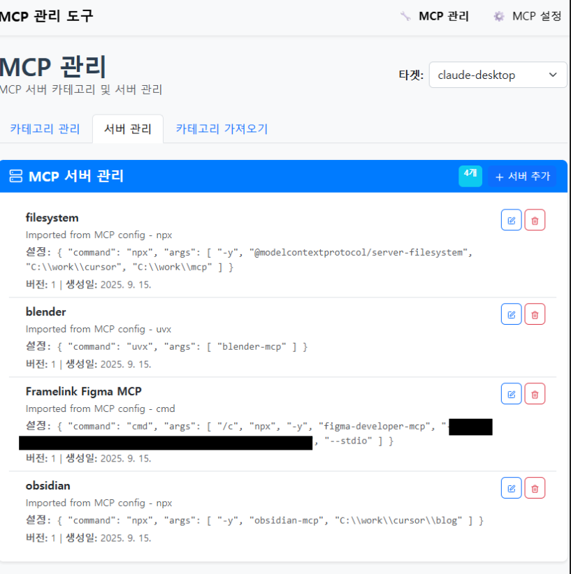
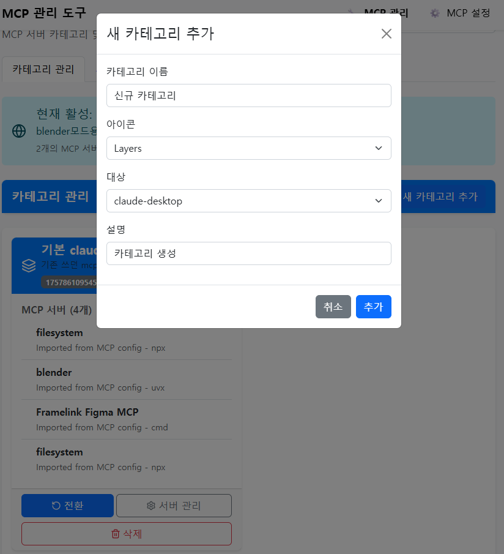
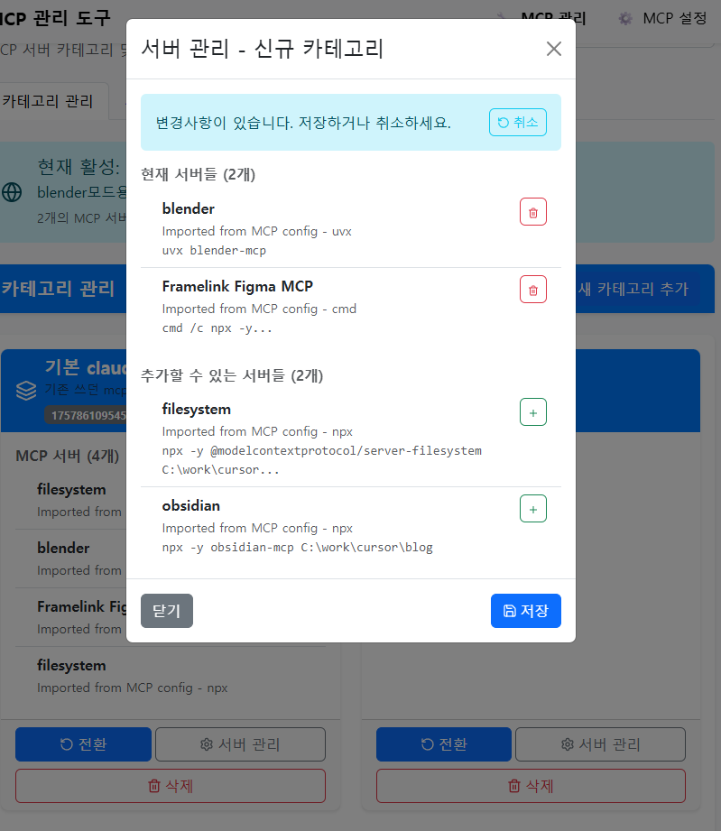
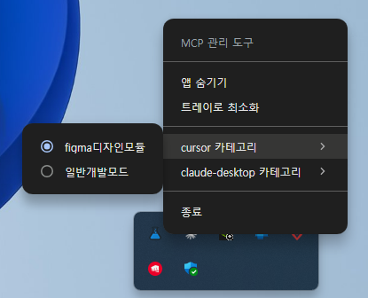
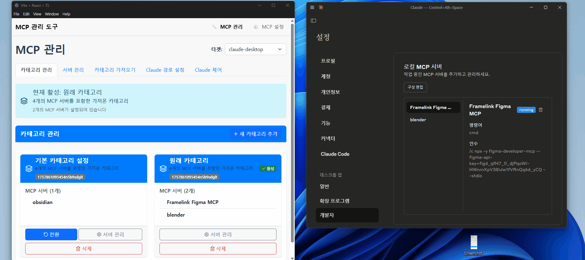

## 해결하고자 한 문제
사용하는 MCP가 늘어나면서 모든 컨텍스트에서 통용되지 않고 일부 상황에서만 쓰는 MCP가 존재함.
수동으로 MCP설정에 추가/삭제하는 것에 대한 부담감이 늘어나고 있음.
이를 해결하기 위해서 카테고리를 통해 MCP서버를 효율적으로 관리하는 프로그램을 제작하였음.
특히, 나의 경우는 Blender, n8n, figma 등도 같이 사용하는데 이런 도구들은 claude나 cursor에서 사용할때 변환하기 매우 불편함.

## 핵심 기능
- 어플리케이션 단에서 설정 조작.
- SYSTEM TRAY를 통해서 손쉽게 변형가능

## 사용방법
### 1. MCP를 사용하는 프로그램에 대한 경로 설정
> 아래는 자주 사용하는 cursor와 claude_desktop 의 설정 json위치를 파일경로로 정의
> 우측 상단 mcp설정 클릭, 이후 새 타겟추가 하고 표시명(영문) 으로 작성

### 2. MCP를 사용하는 프로그램에 대한 경로 설정
**2-1. json에서 한번에 가져오기**
 카테고리 가져오기란에서 json 설정파일을 붙여넣고 설정분석 클릭


 밑에 쓰던 mcp에 대한 내용을 분석해서 가져옴.
 카테고리 생성 클릭시 신규 카테고리 생성





### 2-2. 각자 생성
서버 관리에서 서버 추가 하여 개별생성


카테고리 관리에서 신규 카테고리 추가 생성


생성한 카테고리에서 서버를 추가 생성하기  



### 시스템 트레이 사용



### claude-desktop 자동 재실행
cluade-desktop의 경우 현재 바꿔도 바로 적용이 안된다.
이것을 해결하기 위해 설정 변경시 claude-desktop이 켜져 있으면 claude-desktop이 자동으로 재부팅된다.



**해결하는 문제:**
- 개발 작업 시 필요한 MCP 도구와 일반 작업용 MCP 도구를 구분하여 사용
- 매번 설정 파일을 열어서 수정하는 번거로움 제거
- 다양한 작업 환경에 맞는 MCP 설정을 미리 준비해두고 필요할 때 즉시 전환


## 📁 프로젝트 구조

```
src/
├── components/           # 재사용 가능한 컴포넌트
│   ├── shared/          # 공통 컴포넌트
│   ├── mcpMaintain/     # MCP 관리 관련 컴포넌트
│   └── mcpMaintainSetting/ # 설정 관련 컴포넌트
├── pages/               # 페이지 컴포넌트
│   ├── MCPMaintain.tsx  # 메인 MCP 관리 페이지
│   └── MCPMaintainSetting.tsx # 설정 페이지
├── data/                # 샘플 데이터
├── type.ts              # TypeScript 타입 정의
└── App.tsx              # 메인 앱 컴포넌트
```

## 🔧 설정

### MCP 설정 파일 경로
- **Claude Desktop**: `%APPDATA%\Claude\claude_desktop_config.json` (Windows)
- **Cursor**: `%APPDATA%\Cursor\User\globalStorage\cursor.mcp\mcp_config.json` (Windows)

### 데이터 저장 위치
- **Windows**: `%APPDATA%\mcp-manager\config.json`
- **macOS**: `~/Library/Application Support/mcp-manager/config.json`
- **Linux**: `~/.config/mcp-manager/config.json`

## 🚨 주의사항

1. **API 키 보안**: 민감한 API 키는 "비밀" 옵션을 체크하여 마스킹 처리됩니다
2. **설정 파일 백업**: 중요한 MCP 설정은 별도로 백업해두세요
3. **경로 설정**: Claude Desktop과 Cursor의 설정 파일 경로를 정확히 설정해야 합니다


## 📄 라이선스

이 프로젝트는 MIT 라이선스 하에 배포됩니다.

## 📞 지원

문제가 발생하거나 기능 요청이 있으시면 GitHub Issues를 통해 알려주세요.


