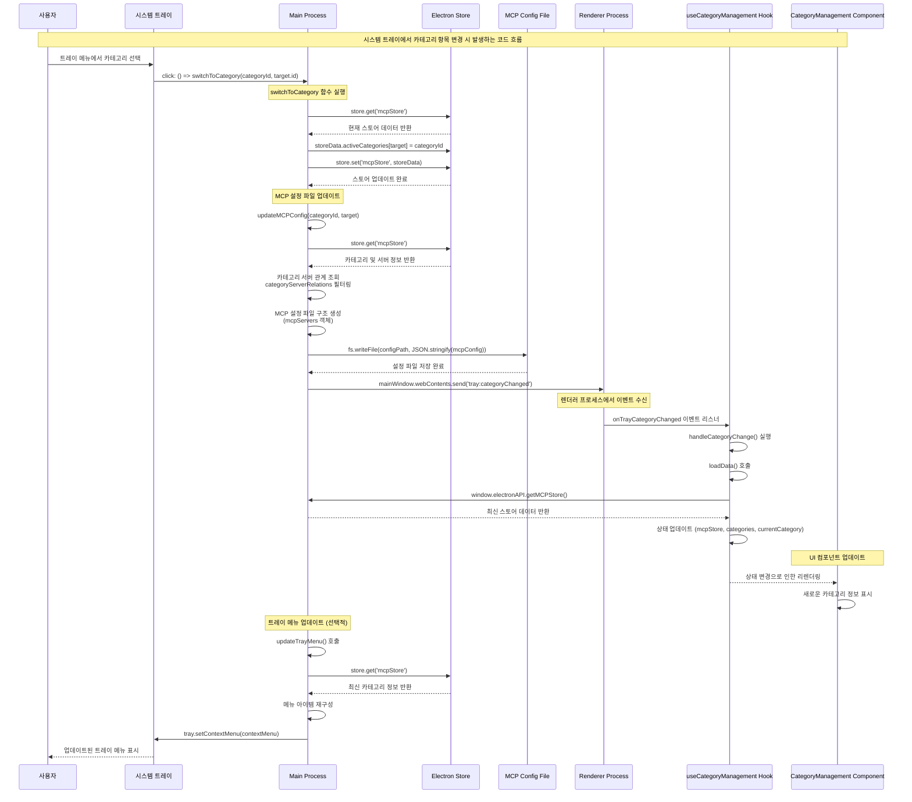

# 시스템 트레이 카테고리 변경 흐름도

## Mermaid.js 다이어그램

## 주요 함수 및 역할

### 1. Main Process (main.js)

#### `switchToCategory(categoryId, target)`
- **역할**: 트레이에서 카테고리 변경 시 호출되는 핵심 함수
- **처리 과정**:
  1. 스토어에서 현재 데이터 조회
  2. 활성 카테고리 업데이트
  3. MCP 설정 파일 업데이트
  4. 렌더러에 변경 알림

#### `updateMCPConfig(categoryId, target)`
- **역할**: 실제 MCP 설정 파일을 업데이트
- **처리 과정**:
  1. 카테고리 정보 조회
  2. 카테고리-서버 관계 조회
  3. 서버 설정 및 키 정보 조합
  4. JSON 파일로 저장

#### `updateTrayMenu()`
- **역할**: 트레이 메뉴를 최신 상태로 업데이트
- **처리 과정**:
  1. 스토어에서 카테고리 및 타겟 정보 조회
  2. 각 타겟별 카테고리 메뉴 생성
  3. 라디오 버튼으로 활성 카테고리 표시

### 2. Renderer Process

#### `useCategoryManagement` Hook
- **역할**: 카테고리 관리 상태 및 로직 제공
- **주요 기능**:
  - 트레이 카테고리 변경 이벤트 수신
  - 데이터 리로드 및 상태 업데이트
  - UI 컴포넌트에 상태 제공

#### `CategoryManagement` Component
- **역할**: 카테고리 관리 UI 제공
- **주요 기능**:
  - 서버 변경사항 저장 시 트레이 메뉴 업데이트
  - 모달 닫기 콜백 처리

### 3. 데이터 흐름

1. **사용자 액션**: 트레이 메뉴에서 카테고리 선택
2. **메인 프로세스**: 스토어 업데이트 및 설정 파일 저장
3. **이벤트 전파**: 렌더러 프로세스에 변경 알림
4. **상태 동기화**: Hook에서 데이터 리로드
5. **UI 업데이트**: 컴포넌트 리렌더링
6. **트레이 업데이트**: 메뉴 상태 동기화

### 4. 핵심 데이터 구조

- **MCPStore**: 전체 애플리케이션 상태
- **activeCategories**: 각 타겟별 활성 카테고리
- **categoryServerRelations**: 카테고리-서버 관계
- **serverKeyRelations**: 서버-키 관계
- **MCP Config**: 실제 Claude/Cursor 설정 파일

